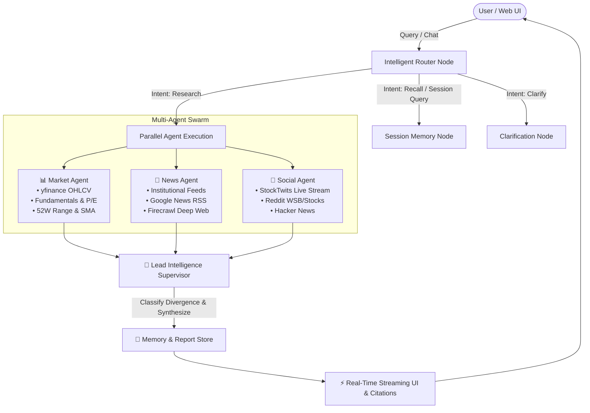

<div align="center">

# ⚡ Stigdiv — Multi-Agent Financial Intelligence & Signal Divergence Engine

**An autonomous multi-agent equity research platform combining institutional market data, real-time news catalysts, and retail trader sentiment to uncover signal divergence.**

[](https://fastapi.tiangolo.com)
[](https://reactjs.org/)
[](https://vitejs.dev/)
[](https://www.typescriptlang.org/)
[](https://langchain-ai.github.io/langgraph/)
[](https://www.python.org/)
[](https://pytest.org)

</div>

---

## 📖 Overview

**Stigdiv** (*Signal Divergence*) is an institutional-grade stock intelligence platform designed to cut through the noise of financial markets. Rather than relying on simple price metrics or LLM hallucinations, Stigdiv deploys a coordinated swarm of specialized autonomous agents that cross-examine:

1. **📈 Quantitative Market Dynamics**: OHLCV price series, moving averages (SMA 50/200), historical ranges, and fundamental valuation multiples.
2. **📰 Tier-1 Institutional News**: Real-time coverage from Bloomberg, Reuters, CNBC, Seeking Alpha, Motley Fool, MarketWatch, and Google News RSS.
3. **💬 Retail & Trader Sentiment**: Live trader streams from StockTwits, multi-subreddit discussions (`r/wallstreetbets`, `r/stocks`, `r/investing`), and Hacker News.

A **Lead Intelligence Supervisor** synthesizes these streams, evaluates whether signals are **ALIGNED**, **MIXED**, or **DIVERGENT**, and delivers actionable insights in plain, professional financial English.

---

## 🏛️ System Architecture



---

## ✨ Key Features

### 1. 🧠 Multi-Agent Swarm Intelligence
- **Dynamic Routing**: Dispatches parallel agents based on user intent (e.g. specialized single-agent briefings vs. full 3-agent divergence reports).
- **Signal Divergence Engine**: Accurately classifies multi-stream consensus as `ALIGNED`, `MIXED`, or `DIVERGENT`.

### 2. 🔍 Deep Financial Research
- **Institutional News**: Live ticker news from Bloomberg, Reuters, Seeking Alpha, CNBC, Motley Fool, and Yahoo Finance.
- **Retail Trader Flow**: StockTwits sentiment tags (`Bullish` / `Bearish`), Reddit upvote metrics, and community discussion themes.
- **Fundamental Ratios**: Market Cap, Trailing & Forward P/E, 52-Week High/Low, 50/200 Day Averages, and Analyst Consensus Targets.

### 3. 📅 Natural Language Timeframe Resolution
- Handles flexible natural language queries:
  - `"research NVDA"` → `5d` short-term momentum
  - `"show 6 months chart of Apple"` → `6mo` trend
  - `"full years stock data of Tesla"` → `1y` timeline with weekly candles
  - Supports `1mo`, `3mo`, `6mo`, `1y`, `2y`, `5y`, `ytd`, and `max`.

### 4. 🎨 Modern Editorial Frontend
- **Framework**: Built with React 18, TypeScript, and Vite.
- **Minimalist Aesthetic**: Dark-mode glassmorphism, responsive dock, and no clutter.
- **Typography**: Google Fonts (`Plus Jakarta Sans` for UI, `Inter` for body text, `JetBrains Mono` for financials).
- **Interactive Lightweight Charts**: Hardware-accelerated TradingView chart canvas with real-time responsive sizing and zero watermarks.
- **Quirky Headlines**: Library of 60 witty stock market zero-state headlines randomized per session.
- **Perplexity-Style Citations**: Clickable source chips for all news publishers, market quotes, StockTwits threads, and Reddit discussions.

---

## 🛠️ Tech Stack

### Backend
- **Core**: Python 3.10+, FastAPI, Uvicorn
- **Orchestration**: LangGraph, Pydantic v2
- **Data Providers**: `yfinance`, `feedparser`, `requests`, `firecrawl-py`
- **LLM Providers**: Multi-provider support for **Gemini 2.0 / 1.5**, **Groq (Llama 3.3 / Mixtral)**, **OpenRouter**, or deterministic offline fallbacks.

### Frontend
- **Framework**: React 18, Vite 5, TypeScript
- **Charting**: `lightweight-charts` (TradingView)
- **Icons**: `lucide-react`
- **Markdown & Citations**: `react-markdown`, `remark-gfm`
- **Styling**: Vanilla CSS Design Tokens (Dark-Mode, Glassmorphism, CSS Grid/Flexbox)

---

## 🚀 Quickstart Guide

### Prerequisites
- Python 3.10+
- Node.js 18+ & npm

### 1. Clone the Repository
```bash
git clone https://github.com/Maheshbabu777/Stigdiv.git
cd Stigdiv
```

### 2. Backend Setup
```bash
# Create and activate virtual environment (optional)
python -m venv venv
# On Windows:
venv\Scripts\activate
# On Linux/macOS:
source venv/bin/activate

# Install Python dependencies
pip install -r requirements.txt
```

### 3. Configure Environment Variables
Create a `.env` file in the root directory:
```env
# LLM Providers (at least one recommended for natural language synthesis)
GROQ_API_KEY=your_groq_api_key
GEMINI_API_KEY=your_gemini_api_key
OPENROUTER_API_KEY=your_openrouter_api_key

# Optional: Deep Web Crawling
FIRECRAWL_API_KEY=your_firecrawl_api_key
```

### 4. Frontend Setup
```bash
cd frontend
npm install
npm run build
cd ..
```

---

## 🖥️ Running Locally

### Option A: Complete App via FastAPI (Single Server)
```bash
python run.py
```
Open **`http://localhost:8000`** in your browser.

### Option B: Development Mode with Vite HMR
```bash
# Terminal 1: Backend
uvicorn src.api.main:app --port 8000 --reload

# Terminal 2: Frontend
cd frontend
npm run dev
```
Open **`http://localhost:3000`** (Vite automatically proxies `/chat` to the backend).

---

## 📡 API Reference

### `POST /chat`
Execute a multi-agent equity research request or follow-up conversation.

**Request Payload:**
```json
{
  "message": "research NVDA for 1 year",
  "session_id": "session-123",
  "use_llm": true
}
```

**Response Format:**
```json
{
  "intent": "research",
  "topic": "Nvidia",
  "ticker": "NVDA",
  "divergence_verdict": "aligned",
  "response": "### Multi-Source Signal Analysis: Nvidia (`NVDA`)...",
  "chart_data": {
    "ticker": "NVDA",
    "period": "1y",
    "interval": "1wk",
    "rows": [
      { "date": "2025-08-01", "open": 115.2, "high": 120.4, "low": 114.1, "close": 118.8, "volume": 45000000 }
    ]
  },
  "sources": {
    "news": [
      { "title": "Nvidia expands AI datacenter infrastructure", "link": "https://...", "publisher": "Reuters" }
    ],
    "social": [
      { "source": "StockTwits", "title": "Heavy call volume on $NVDA today", "sentiment": "Bullish", "link": "https://..." }
    ],
    "market": [...]
  }
}
```

### `POST /session/end`
Clear session chat history and cached reports.
```json
{
  "session_id": "session-123"
}
```

### `GET /health`
Verify server and agent pipeline health status.

---

## 🧪 Testing & Validation

The project includes an extensive test suite covering unit tests, stress testing, agent mocking, API endpoints, and graph routing:

```bash
# Run the complete test suite
pytest -v
```

**Results:** `135 passed (100%)` across all suites.

---

## 🐳 Docker Deployment

The application includes a production-ready Dockerfile:

```bash
# Build the Docker image
docker build -t stigdiv:latest .

# Run the container
docker run -p 8000:8000 --env-file .env stigdiv:latest
```

---

## ⚠️ Disclaimer

*This software is an automated research and educational tool. The intelligence summaries, divergence metrics, and market data provided by Stigdiv do **not** constitute financial, investment, or legal advice. Always conduct your own independent due diligence.*

---

## 📄 License

MIT License. See [LICENSE](LICENSE) for details.
